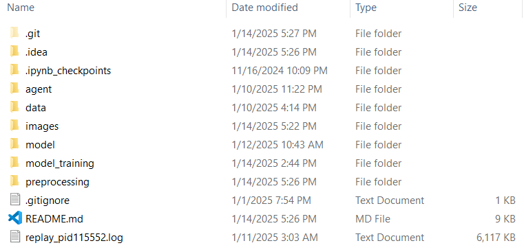
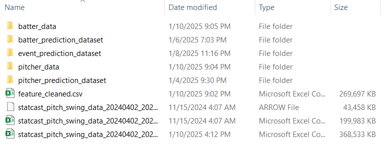

# Modeling Baseball Pitching and Batting Dynamics: From Linear Regression to Intelligent Agent Simulation
## Exploring Performance Prediction and Strategy Simulation Using Statistical and Cognitive Frameworks

## How to run?
Because of the zip size limit, we can't submit data files. I would like you to place the dataset `statcast_pitch_swing_data_20240402_20241030_with_arm_angle2.csv` provided by the contest in the data folder. And run the script one by one in numerical order (from `00_CSAS_Data.ipynb` to `13_event_prediction_model_training.py`), those data files not submitted will be generated gradually during the run. Some scripts will consume a long time to run, for the three model training scripts, if you don't want to run them again, I provide the `ipynb` file, you can view the training effect directly. Also, I would like you to arrange the folder and create missing folders inside the root folder as shown in the picture or in `Github`, so that you can solve the problem of reading the path of some files.

And you also need to create the folders `batter_data`, `pitcher_data`, `pitcher_prediction_dataset`, `batter_prediction_dataset`, `event_predicion_dataset` (just blank folders with these name) in the `data` folder as shown below.

Ensure all necessary Python packages (e.g., pandas, numpy, statsmodels, matplotlib, seaborn, sklearn, XGboost, Catboost) are installed.
---

## Introduction to Scripting
1. `00_CSAS_Data.ipynb` conducted data preprocessing, EDA and statistical analysis, tried to use some regression models and carried out visual display.
2. `01_data_clearing.py` read `./data/statcast_pitch_swing_data_20240402_20241030_with_arm_angle2.csv` and removed obsolete or invalid features.
3. `02_data_split.py` tried to split the dataset into `./data/batter_data` and `./data/pitcher_data` based on `batter` and `pitcher`.
4. `./agent/batter_agent.py` and `./agent/pitcher_agent.py` are two agent class scripts that record the player level summarized through the player's historical data, as well as the player level performance when dealing with specific opponents.
5. `03_generate_pitcher_agent.py` and `07_generate_batter_agent.py` created the needed agents and fill in their information based on the presence of players in the dataset. Save the new dataset to `./data/pitcher_prediction_dataset/pitcher_prediction_dataset.csv` and `./data/batter_prediction_dataset/batter_prediction_dataset.csv`.
6. `04_pitcher_prediction_data_preprocessing.py` and `08_batter_prediction_data_preprocessing.py` hot-encoded the non-numeric elements in the dataset and assign values in order of frequency of occurrence. And the datasets were saved `./data/pitcher_prediction_dataset/pitcher_prediction_dataset_V3.csv` and `./data/batter_prediction_dataset/batter_prediction_dataset_V3.csv`.
7. `05_pitcher_multi_memory.py` and `09_batter_multi_memory.py` added data to the agent about the type of pitch or shot and its effect in the previous rounds to achieve the effect of adding a "memory". And saved data to `./data/pitcher_prediction_dataset/pitcher_prediction_dataset_V4.csv` and `./data/batter_prediction_dataset/batter_prediction_dataset_V4.csv`.
8. `06_pithcer_agent_model_training.py` and `10_batter_agent_model_training.py` used GridCV to find the best dimension and parameters for the prediction model. We tried to train Catboost model and MLP model and saved the best model in `model` folder. And more training details showed in `06_pithcer_agent_model_training.ipynb` and `10_batter_agent_model_training.ipynb`. 
9. `11_event_prediction_dataset.py` collate and select features for event/des prediction and save the dataset to `./data/event_prediction_dataset/event_prediction_dataset_V3.csv`
10. `12_event_batter_memory.py` added the relevant confidence of previous rounds to the agents involved in this part of the prediction work, to achieve the effect of simulating 'memory'. Save the dataset to `./data/event_prediction_dataset/event_prediction_dataset_V4.csv`
11. `13_event_prediction_model_training.py` used GridCV to find the best dimensions and parameters for training the model. And we saved best model in `model` folder.

--- 
## Starting from Data Analysis and Regression (`00_CSAS_Data.ipynb`)

### 1. Data Preprocessing

#### Data Cleaning:
- Removed columns with all missing values.
- Converted categorical columns to numerical representations.
- Transformed the `game_date` column to datetime format.
- Removed irrelevant columns (e.g., player IDs).

#### Feature Engineering:
- Created binary variables for runners on bases (`runner_on_1b`, `runner_on_2b`, `runner_on_3b`).
- Added a `score_diff` column (batting score – fielding score).
- Applied PCA for `release_pos_x`, `release_pos_y`, `release_pos_z` to derive a `release_pca` variable representing the comprehensive release position.

---

### 2. Handling Missing Data

- Filled missing values in numerical variables with their median.
- Filled missing categorical values with `"Nothing happened or Data missed."`

---

### 3. Exploratory Data Analysis (EDA)

#### Normality Check:
- Conducted Q-Q plots and Shapiro-Wilk tests to check the distribution of continuous variables.

#### Variance Homogeneity:
- Used Levene’s test to check homoscedasticity between groups.

#### Scatter Plot Analysis:
- Plotted scatterplots with regression lines to visualize the relationships between independent variables and `bat_speed`.

#### Correlation Analysis:
- Computed Pearson correlation coefficients and visualized them using a heatmap.

---

### 4. Regression Modeling

#### Initial Robust Linear Regression:
- Included categorical variables (encoded as dummy variables).
- Conducted robust regression (OLS with HC3 standard errors).

#### Significance Filtering:
- Removed variables with p-values > 0.05 to create a refined model.

#### Model Diagnostics:
- Plotted residuals to assess normality and homoscedasticity.
- Computed VIF (Variance Inflation Factor) to check multicollinearity.

#### Box-Cox Transformation and Weighted Least Squares (WLS):
- Applied Box-Cox transformations to continuous variables to stabilize variance.
- Used WLS to address heteroscedasticity.

---

### 5. Exploration of Alternative Models

- Attempted adding interaction terms to improve model fit.
- Conducted model tuning to check for improvements in R-squared and overall diagnostics.

---

### 6. Visualization

#### Pitch Events:
- Created scatter and bar plots to illustrate relationships between pitch types, swing length, and `bat_speed`.
- Created merged event categories (e.g., Hit, Out, On Base, Error, Sacrifice) for meaningful comparisons.

#### Distribution Plots:
- Plotted 3D scatter plots to visualize `release_speed` and `release_position`.
- Stacked bar plots were used to show the distribution of resulting pitch outcomes for different pitch types.

### Key Insights and Challenges

- Normality and Heteroscedasticity Issues: Despite applying transformations and robust regression methods, residuals exhibited non-normality and unequal variances.

- Multicollinearity: VIF tests confirmed no significant multicollinearity after filtering variables.

- Data Visualization: Visualizations were essential to identify outliers, trends, and unexpected behaviors.

---
## BDI Model: Belief-Desire-Intention Framework (`01_`-`13_` Scripts)

The **Belief-Desire-Intention (BDI) Model** is a theoretical framework in artificial intelligence and cognitive science, designed to describe the decision-making and behavior processes of rational agents. It is particularly suitable for multi-agent systems (MAS), enabling the development of intelligent systems that simulate human behavior.

### Key Components:
- **Belief (B):** Represents the agent's perception and knowledge about the environment and its own state.
- **Desire (D):** Represents the goals or states that the agent aims to achieve.
- **Intention (I):** Represents the agent's chosen current goal from multiple desires and the specific plans formulated to achieve it.

---

## Pitcher Agent
- **Belief (B):** Comprises the pitcher’s internal levels, such as pitching speed, strike-ball ratio, and memory of previous pitch types and their outcomes in the game.
- **Desire (D):** Refers to the anticipated outcome (e.g., score or event) following the next pitch.
- **Intention (I):** Represents the pitcher’s choice of pitch type (pitch_type) in the next pitch to achieve the desired outcome.

---

## Batter Agent
- **Belief (B):** Includes the batter's internal levels, such as swing speed, power-hitting ability, and memory of previous batting types and their outcomes in the game.
- **Desire (D):** Refers to the anticipated outcome (e.g., score or event) following the next hit.
- **Intention (I):** Represents the batter’s choice of batting type (bb_type) in the next hit to achieve the desired outcome.

---

## Environment
The dataset is sorted by `game_pk`, `at_bat_number`, and `pitch_number` to recreate the sequence of pitcher-batter confrontations in a game. Contextual information, such as the on-base situation and current score, is used as the environmental data that interacts with both the pitcher and batter agents.

---

# Simulation Framework

The simulation primarily focuses on interactions between the pitcher and batter. The model consists of three main components, executed in sequential order:

### 1. Pitcher-Environment Interaction
#### Data Components for the Pitcher Agent:
1. Historical performance metrics summarizing all games the pitcher has participated in.
2. Historical performance metrics summarizing the pitcher’s encounters with the current batter.
3. Memory of previous pitch types and their outcomes in the ongoing game.

#### Environmental Data:
The environment includes the on-base situation, current score, and other contextual information.

#### Objective:
Train a machine learning or deep learning model to predict the **pitch type (pitch_type)**, which represents the **intention** of the pitcher agent in the current situation.

---

### 2. Batter-Environment Interaction
#### Data Components for the Batter Agent:
1. Historical performance metrics summarizing all games the batter has participated in.
2. Historical performance metrics summarizing the batter’s encounters with the current pitcher.
3. Memory of previous batting types and their outcomes in the ongoing game.

#### Environmental Data:
In addition to the on-base situation and current score, the environment includes actual data captured from the pitcher's throw.

#### Objective:
Train a machine learning or deep learning model to predict the **batting type (bb_type)**, which represents the **intention** of the batter agent in the current situation.

---

### 3. Pitcher-Environment-Batter Interaction
#### Process:
Using the actual data recorded after the batter hits the ball, train a machine learning or deep learning model to predict **events or outcomes (e.g., score changes or on-base situations)**. Update the environment with these new states, such as updated on-base situations and scores, for the next sequence of interactions.

---

## Simulation Results

The simulation results demonstrate varying levels of accuracy across the three prediction targets. The **Pitch Type** prediction achieved an accuracy of 60%, which, while moderate, highlights the complexity and variability of pitcher decision-making in real-world scenarios. The **Hit Type** prediction showed a significantly higher accuracy of 82%, suggesting that batter behavior is more predictable under the given environmental and historical data. Finally, the **Event/Des** prediction achieved the highest accuracy at 84%, reflecting the model's effectiveness in capturing the overall interaction dynamics between the pitcher and batter agents and their impact on game outcomes. 

These results indicate that the simulation successfully captures the strategic interplay in baseball scenarios, with room for improvement in the prediction of individual pitcher actions. Enhancing the feature set or adopting more advanced modeling techniques could further refine the predictions and improve the overall effectiveness of the simulation.

| **Prediction Target** | **Accuracy** |
|------------------------|--------------|
| Pitch Type            | 60%          |
| Hit Type              | 82%          |
| Event/Des             | 84%          |

